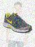

# Introduction
The model described below achieved 97.7% on the private dataset of [this](https://www.kaggle.com/c/uw-cs480-fall20) kaggle competition. The rankng of this submission is among the top 5%.

The competition aims to classify e-commerce samples into 27 categories (e.x. shoes, watches, topwears, pants, sandals, etc).

# Dataset
The dataset consists of 3 compoenents:
1. Noisy images. The images are corrupted with noise to some degree. This example is an image of sunglasses with the background noisy of a dress, which is also one of the categories to classify. This could confuse the classifier.

   
  <i>Example image - sample 1164</i>

2. Noisy text description. An example of the noisy text description is `Nike Roshe Dart Cherryshine MSL tshirt Sports Shoes`. The corresponding class of this sample is `shoes`; however, there is `tshirt` in the description. This could confuse the classifier.

   
  <i>Example image - sample 7901</i>

3. Categorical data. It is expected that these high-level categorical features would provide less information than the image or the text description because many classes would share the same high-level categorical features.

Since the data is noisy, using either image or text description alone would not be sufficient. A model that leverages all 3 components of the dataset would likely to achieve desired results.

# Model
There are 3 components of the model:
1. CNN - Images
2. LSTM - Noisy text description
3. FC NN - Categories

## Image
### Augmentation
Only random rotation is used to augment the dataset. Initially, I also attempted random translation and scaling; however, the results were not good because the objects are already in the center of images with a detectable scale.

### CNN
Multiple pretrained models on ImageNet were fine tuned, the list of models being attempted includes Resnet 101, Densenet 121, VGG-19 with batchnorm. Densenet 121 achieves the highest accuracy of 92%.

## Noisy Text Description
### Text Description Cleaning
The noisy text description is first cleaned by removing the punctuations, numbers and symbols. Then the words are converted to the lower cases and stemmed cases. TODO - stemmed cases.

### word2vec
After cleaning, there are around 6200 distinct words, which are represented by one-hot vector encoding. Then an embedding layer is used to reduce the dimension to 800, which is determined through hyperparameter tuning.

### LSTM
LSTM is used to process the words in sequence. To enable batch training, all samples are of size 800x14. If the desciption contains less than 14 words, the subsequent columns are empty.

## Categorical Data
The categories are convert as one-hot represention and fed to a 3-layer FC NN. The inpute of the FC NN is 62.

The accuracy of using CNN, LSTM or FC NN alone achieves 92%, 88%, 51% respectively. Combining them together, the accuracy is 96%.

# Ensemble
During the competition, I only had time / computation power to try out different architectures for the CNN compoenent of the models. For future work, different architectures could be attempted for the noisy text description and the categories.

Pretrained vision model used and the achieved accuracy on validation set:
1. resnet50 - accuracy 95.8%
2. resnet101_32x8d - accuracy 96.0%
3. wide_resnet_101_2 - accuracy 95.9%
4. densenet121 - accuracy 96.3%
5. densenet161 - accuracy 95.8%
6. vgg16_bn - accuracy 96.1%
7. vgg19_bn - accuracy 96.0%

Ensemble accuracy on validation set is 97.7%.

The ckpt of the ensembled models can be found in my [onedrive](https://uofwaterloo-my.sharepoint.com/:f:/g/personal/z74ma_uwaterloo_ca/En6-MHXglFdAnpFFs74i0jEBJfnlzRD1BTYL2zNpiJPLfQ?e=6tyXLq).